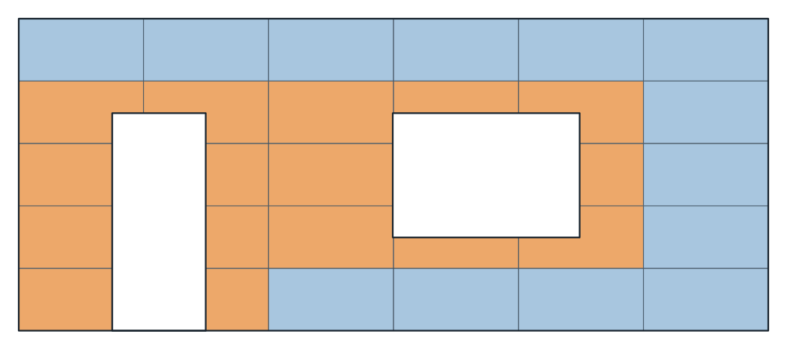
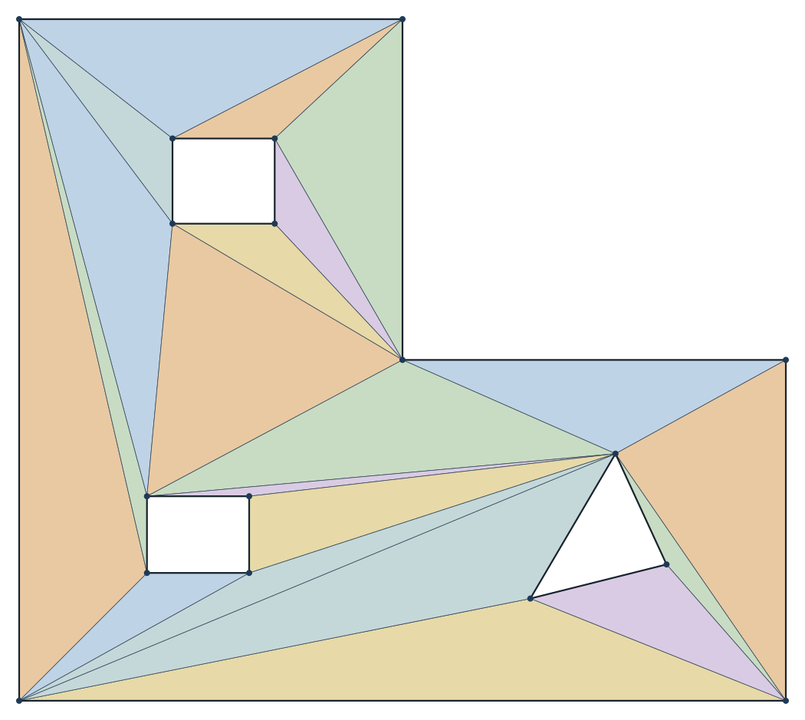
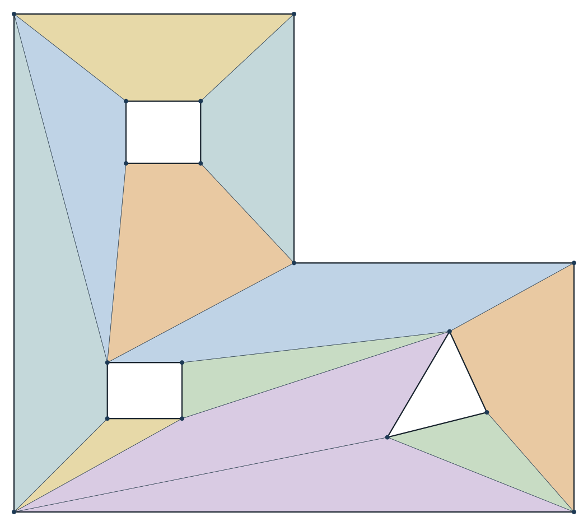
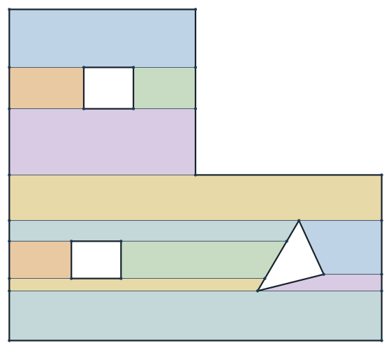
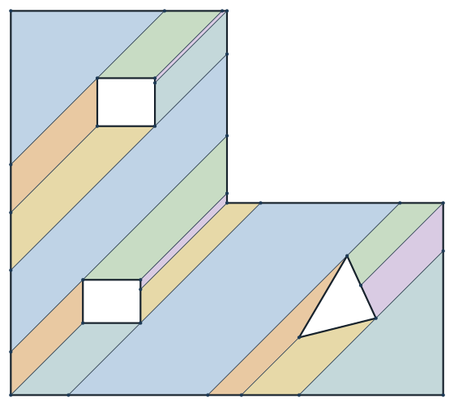
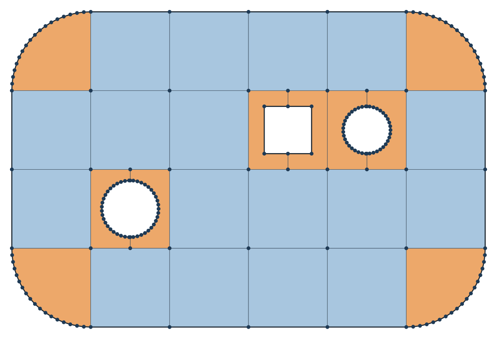
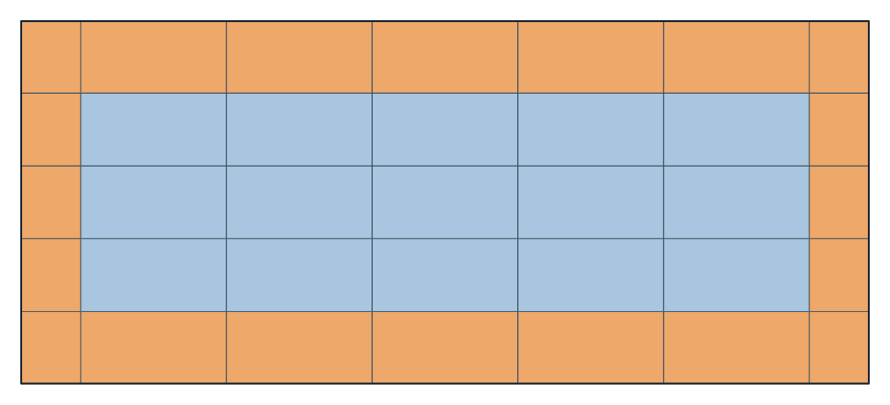
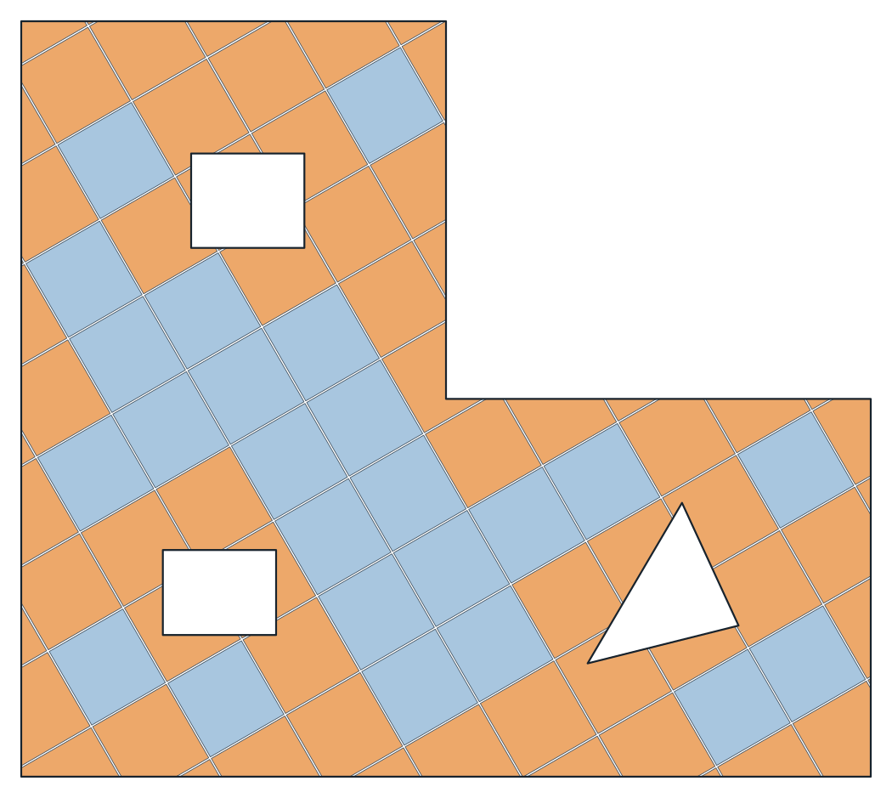
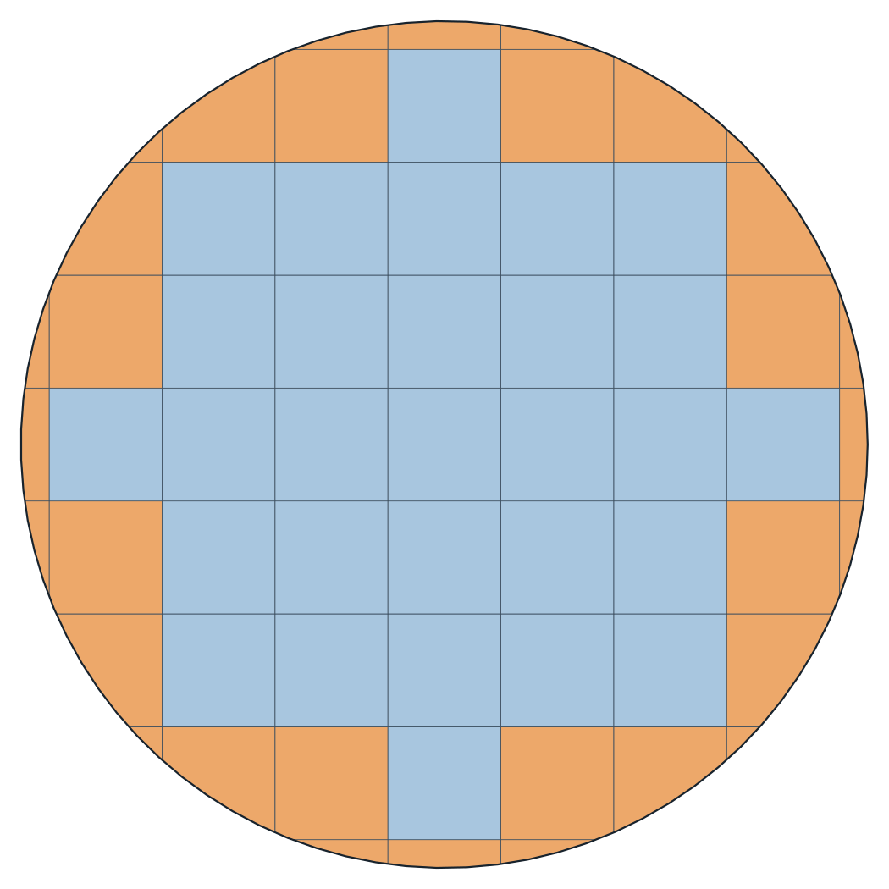
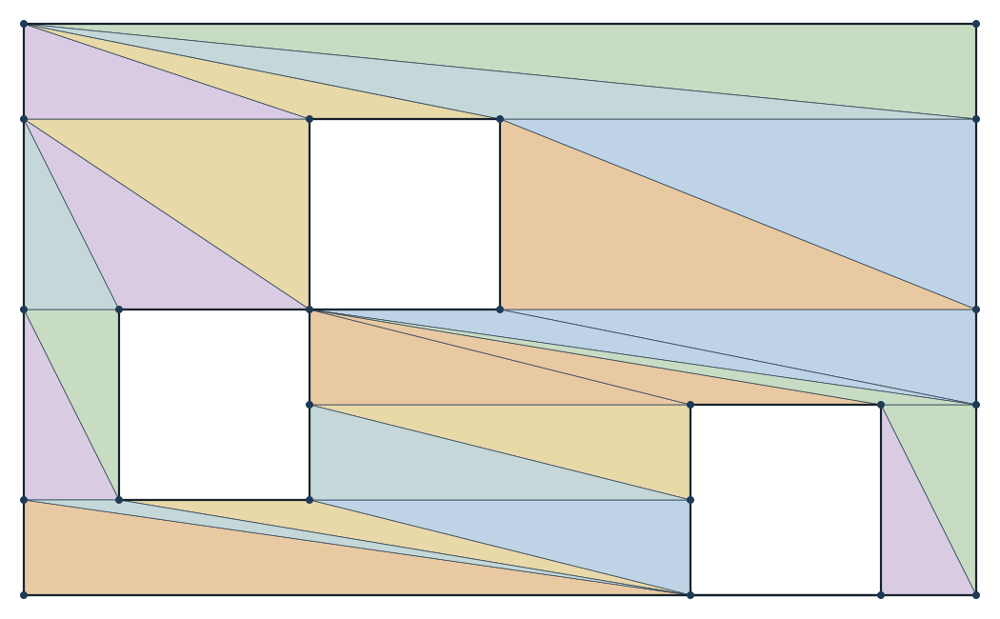

# Meshing the plane

`GeometryHelper.Meshing` breaks a closed shape of the plane into smaller faces: triangles, the cells of a grid, strips,
or convex pieces. Polygons, faces with holes, loops with arcs, rectangles and circles all mesh the same way, with
`ToMesh`. What comes back is a `GeoMesh2`. Its faces are simple polygons with no hole, running counter-clockwise.
They share their corners, and two faces side by side meet along the same edge.

The flat shapes of space mesh the same way, standing in their own plane, and bodies cut into the cells of a grid:
see [meshing in space](mesh3.md).

## Quick start

Panels of formwork, 1200 by 600 with joints of 3 mm, on a wall with a door and a window:

```csharp
using System.Linq;
using GeometryHelper.Geometry;
using GeometryHelper.Meshing;

// Six panels of 1200 and five of 600 fit it with joints of 3 between them: 6 x 1203 - 3 by 5 x 603 - 3.
var wall = new GeoFace2(
    Box(0, 0, 7215, 3012),
    new[]
    {
        Box(900, 0, 1800, 2100),      // a door
        Box(3600, 900, 5400, 2100),   // a window
    });

GeoMesh2 panels = wall.ToMesh(MeshOptions.Grid(1200, 600, joint: 3));

int whole = Enumerable.Range(0, panels.FaceCount).Count(panels.IsWhole);   // 13
int cut = panels.FaceCount - whole;                                         // 16
```

`Box` stands for a polygon of four corners. Each panel is one face, `panels.GetFace(i)`. A panel the door or the window
cuts is cut to it, and `IsWhole` tells the 13 whole panels from the 16 cut ones.



## Four kinds

| `MeshKind` | The faces | For |
|---|---|---|
| `Triangles` | triangles on the shape's own corners, as few as cover it | drawing, measuring, export |
| `Grid` | the cells of a regular grid, cut where the boundary or a hole crosses them | formwork, tiles, cladding, pour bays |
| `Strips` | trapezoids along a direction, cut at every corner | working a region strip by strip |
| `Convex` | convex pieces, few of them | algorithms that need convex parts |

```csharp
GeoMesh2 triangles = slab.ToMesh(MeshKind.Triangles);
GeoMesh2 convex = slab.ToMesh(MeshKind.Convex);
GeoMesh2 strips = slab.ToMesh(MeshKind.Strips);          // along the X axis
GeoMesh2 turned = slab.ToMesh(MeshOptions.Strips(Math.PI / 2));
GeoMesh2 grid = slab.ToMesh(MeshOptions.Grid(1000, 1000));
```

For an L-shaped slab with two openings, these give 16 triangles, 9 convex pieces, 8 strips one way and 8 the other, and
56 cells. All five cover the same area.

The same kinds on a slab with three openings, one of them a triangle:

| | |
|---|---|
|  |  |
| `Triangles`, 21 faces | `Convex`, 12 pieces |
|  |  |
| `Strips`, 12 along the X axis | `Strips(Math.PI / 4)`, 18 |

The dots are the mesh's vertices. Those along the sides of strips are corners of the strip beside, put there so that
the strips meet edge to edge.

`Triangles` gives the triangles `TriangulateSurface` gives. `Convex` merges them across every edge whose two sides stay
convex together, longest edges first, as Hertel and Mehlhorn merge them. It leaves no more than four times as many
pieces as the fewest there could be. A convex shape is one piece. A strip runs between two lines through corners of the
shape, so its two parallel sides run the way the strips do; it comes to a point at a corner.

`ToMesh(MeshKind)` takes every kind but the grid, which needs the size of its cells.

## The grid

`MeshOptions.Grid(cellWidth, cellHeight)` lays cells along the X and Y axes. A cell the material holds is whole. A cell
the boundary or a hole crosses is cut to them, and may come back in more than one piece. A cell that holds a hole whole
is split across it, through the middle of the hole, so that no face has a hole.



**Joints.** `joint` is the gap between two neighbouring cells, along both axes, as the joints between panels or tiles.
The cells stand `cellWidth + joint` apart. There is no gap at the boundary: a cell there is cut to it. When a gap is
wanted along a wall, offset the region inwards first. Faces with joints between them touch no other face, so
`GetAdjacentFaces` gives none.

**Where the grid stands.** A shape is seldom a whole number of cells wide, and the alignment along each axis says where
the cut cells go. Measured between the shape's furthest corners, a strip 1000 wide in cells of 300 is laid as:

| `GridAlignment` | Cells, from the left |
|---|---|
| `Start` | 300, 300, 300, 100 |
| `End` | 100, 300, 300, 300 |
| `CenterCell` | 50, 300, 300, 300, 50 |
| `CenterJoint` | 200, 300, 300, 200 |

```csharp
GeoMesh2 mesh = strip.ToMesh(MeshOptions.Grid(300, 100, 0, GridAlignment.CenterCell));
```

The two centred ones cut the same at both ends. A tiler picks between them so that the cut cells are not too narrow.



**An origin and an angle.** An origin puts a cell's first corner on a point, and takes the place of the alignments. An
angle turns the grid's first axis counter-clockwise from the X axis:

```csharp
var options = new MeshOptions(MeshKind.Grid, 1500, 1500, angleRad: Math.PI / 6, origin: new GeoPoint2(2400, 1800));
GeoMesh2 mesh = slab.ToMesh(options);   // a cell's corner on the column at (2400, 1800)
```



**Rectangles.** A rectangle's grid runs along its own sides unless an angle is given, and starts at its lower left corner.
`Divide(columns, rows)` gives the same cells as rectangles, when they fit evenly:

```csharp
var plate = new GeoRectangle2(new GeoPoint2(1000, 2000), 2400, 1200, Math.PI / 5);

GeoMesh2 mesh = plate.ToMesh(MeshOptions.Grid(600, 400));   // 12 whole cells, turned as the plate is
GeoRectangle2[] cells = plate.Divide(4, 3);                 // the same 12, as rectangles
```

**Curves.** A loop with arcs is flattened first, and so is a circle, each arc cut so that it strays no further than the
options' chord tolerance. Nought picks the automatic share of each radius.



## The mesh

```csharp
GeoMesh2 mesh = Box(0, 0, 3000, 2000).ToMesh(MeshOptions.Grid(1000, 1000));

GeoPolygon2 first = mesh.GetFace(0);            // a polygon, counter-clockwise
int[] corners = mesh.GetFaceIndices(0);         // its corners in mesh.Vertices
int[] beside = mesh.GetAdjacentFaces(0);        // the faces sharing a side with it
GeoLine2[] outline = mesh.GetBoundaryEdges();   // the material on the left of each
GeoTriangle2[] triangles = mesh.ToTriangles();  // for a renderer or an OBJ file
```

The 6 cells share 12 vertices. `GetEdges` gives every edge once, and `GetBoundaryEdges` the edges only one face has: the
outline and the rims of the holes, and with joints the outline of every cell. `Area` is the area the faces cover, the
material less the joints. `ToTriangles` breaks each face into triangles on its own corners, so the triangles of two
faces side by side meet edge to edge too. `Translate`, `RotateBy` and `TransformBy` move the mesh. A mirror turns each
face round, so that it still runs counter-clockwise.

## Triangles without a mesh

`TriangulateSurface` on the same five shapes gives the triangles alone, counter-clockwise, holes left open:

```csharp
var face = new GeoFace2(Box(0, 0, 1000, 1000), new[] { Box(400, 400, 600, 600) });

GeoTriangle2[] triangles = face.TriangulateSurface();
```

A disc is fanned from its center. `GeoTriangle2` is the triangle of the plane, and is described with the
[geometry in the plane](plane.md).

## What is promised

- Every face is a simple polygon with no hole, counter-clockwise, with three corners or more.
- The faces lie within the material and cover all of it without overlapping, holes left open, except the joints of a
  grid.
- Faces meet edge to edge. A corner of one face standing on the side of another is a corner of that one too, which can
  leave a face with three corners in a row. An edge two faces share is run the two ways round.
- The shape's own corners are the mesh's vertices, exactly.
- A polygon crossing itself is read as the region `MakeValid` reads. Holes that touch each other or the boundary are
  taken as the booleans take them.



The tolerance reads the shape: which of its rings touch, what has no area, and for a grid which cells are whole. A cell
the boundary cuts by no more than the point tolerance counts as whole, and keeps the shape it was cut to. A joint no
wider than the point tolerance is none. Points of the pieces are joined only where they are the same but for rounding.
Where features of the shape stand closer than the tolerance, the pieces between them are slivers, and they are kept, so
that the material is covered.

A grid's cell has to be larger than the point tolerance both ways. A grid that would lay more than 4 000 000 cells over
the shape is refused as cells far smaller than were meant; 320 000 cells over a slab of 3 200 m2 take about a second and
a half.
