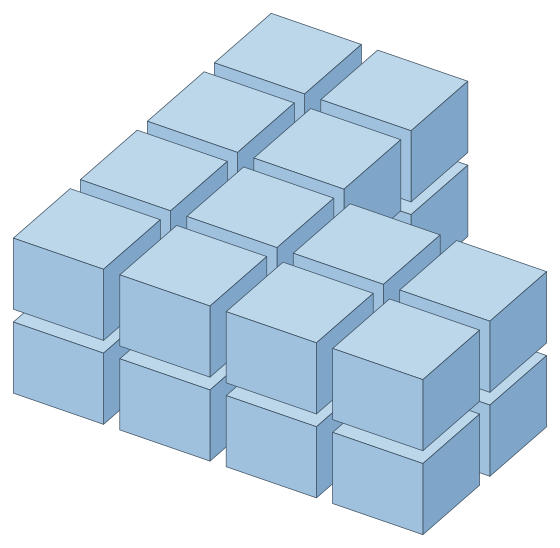

# Meshing in space: cases and checks

What [meshing in space](mesh3.md) does, case by case, drawn and measured, and how it was checked: the tests, the random
shapes and bodies it was held to, the faults those found, and what is left as a limit. Every number here comes from the
code as it is; the cases are the examples of the guide, which run as tests.

The pictures look at the scene from the front right, above. A whole cell is blue and a cut one orange, in three shades by
which way a face looks; the triangles of a mesh take the palette of [the plane](mesh.md). Cells are drawn moved apart from
the middle of their grid, so that each shows.

## Flat shapes

| Case | Shape | Options | Faces | Whole | Checked |
|---|---|---|---|---|---|
| A wall standing in space | a face 7215 by 3012 in the plane y = 0, a door and a window | `Grid(1200, 600, joint: 3)` | 29 | 13 | the same panels as its elevation in the plane |
| A gable roof | two sides 6000 by 3000, 30 degrees up | `Grid(400, 300)` | 150 + 150 | all | rows level, the second axis up each slope |
| A plate lying askew | a rectangle 2400 by 1200 turned about two axes | `Grid(600, 400)`, `World` and `Own` | 21 and 12 | 3 and 12 | `Own` runs along its sides whichever corner its loop starts at |
| Two walls at a corner | 5000 and 4000 long, 2900 high | `Grid(1200, 600, joint: 10)`, one origin | 30 and 24 | 12 and 8 | the rows stand at the same heights on both |
| A disc on a slope | radius 1500, its normal (1, -1, 2) | `Triangles`, `Grid(400, 400)` centred | 50 and 61 | 29 | the vertices on the disc's plane, within its rim |
| A slot standing up | 2400 by 600, round ends | `Strips`, `Convex` | 25 and 1 | | the slot's corners are vertices exactly |

The wall is laid out in a frame of its plane, its first axis level along it and its second up it, as its elevation is
drawn, and meshed there as the plane meshes it: the same 29 panels and the same 13 whole ones, put back on the wall.

The plate's sides are not level, so a level grid crosses it, 21 faces and only 3 of them whole. Along its own sides it
divides into its 12 cells.

## Bodies in cells

| Case | Body | Options | Cells | Whole | Volume held |
|---|---|---|---|---|---|
| A box | 1000 by 600 by 400 | `Grid(300, 300, 300)` | 16 | 6 | 240 000 000, all of it |
| An L-shaped footing | 2000 square, 800 high, its step at 1000.005 | `Grid(500, 500, 400)` | 24 | 24 | 2 400 004 000, all of it |
| A step 30 past a line | the same footing, its step at 1030 | `Grid(500, 500, 0)`, snap of the tolerance and of 50 | 14 and 12 | 12 and 6 | all of it |
| A U | 3000 by 2000, 500 high | `Grid(0, 1000, 0)` | 3, two of them pieces of one cell | 0 | 2 400 000 000, all of it |
| A slab with a shaft | 12000 by 8000 by 250, a shaft 1500 by 1200 | `Grid(6000, 4000, 0)` | 4 | 0 | 23 550 000 000, the net volume |
| A cylinder | radius 600, 2000 high, 48 sides | `Grid(300, 300, 500)` | 64 | 16 | 2 255 492 601.6, all of it |
| A wall turned in plan | 6000 by 200 by 3000, turned 30 degrees | `Grid(1000, 0, 1000)`, `Upright` and `World` | 18 and 18 | 18 and 0 | all of it |
| A wall of blocks | 4000 by 190 by 2400 | blocks of 390 by 190, joints of 10 | 120 | 120 | 1 689 480 000, less the joints |
| A column in lifts | 400 square, 3500 high | `Layers(1000)` | 4 | 3 | 1000, 1000, 1000 and 500 high |
| A box turned in space | 2000 by 1000 by 600 | `Grid(500, 500, 300)`, `Own` and `World` | 16 and 54 | 16 and 2 | 1 200 000 000, all of it |

The footing's step stands five thousandths past the line between two columns of cells. The cut along that line snaps onto
the step, so that no slice five thousandths thick is cut off: every one of the 24 cells is whole, the cells beside the step
500.005 long and the ones past it 499.995.

With the step 30 past the line, the point tolerance leaves the slice 30 thick as two cells of their own, on the left. A snap
distance of 50 moves the cut onto the step, through the whole footing: the slice goes with the cells beside, and the cells
either side of the cut, 530 and 470 long, are no longer whole, on the right.

The row over the arms holds two pieces of one cell, (0, 1, 0) pieces 0 and 1. The base meets both arms, and the arms do
not meet each other: the neighbours of cell 0 are cells 1 and 2, and each arm's only neighbour is cell 0.

The shaft is cut in first, so each bay is cut to it; together they hold the slab's net volume to the cubic millimetre.
Bay 0 meets bays 1 and 2 across their shared sides, and bay 3 meets bays 1 and 2.

## How it was checked

**Tests.** 39 tests of flat shapes in space, 55 of cells, 11 that run the guide's examples, and 1 140 that replay the
fuzz below: the 40 cases that once found a fault and 1 100 others. Each fault below has a test of its own as well, which
failed before it was fixed. A flat mesh is held, laid out in its frame, to every promise of the meshes of the plane: faces
simple, counter-clockwise and edge to edge, the material covered once and nothing else; and in space to its own: vertices
on the plane, the shape's corners exactly, a side's points on the side in space. A grid of cells is held to closed cells
of the volumes they say, within their boxes, in order, points of the body in one cell and none outside it, its neighbours
each other's and, in a grid of up to 60 cells, every two sharing part of a face among them, and none of the cutting warned
of.

**Random shapes and bodies.** A port of the fuzz runs as the replay tests above. The flat shapes are stars of 3 to 12
corners with up to two holes, laid on random planes near the origin and seven kilometres out, a quarter of them a hair out
of flat, meshed in every kind, by grids of random cells, joints, angles and alignments, placed every way and from origins
near and far. The bodies are prisms of stars with holes, unions and differences of boxes, cylinders of 8 to 48 sides,
slabs with openings, L shapes whose step stands a hair to either side of a line of cells, and U shapes, turned and moved
the same ways, cut by random sizes, counts, whole axes, joints and snap distances along every kind of axes.

Since the guide was first written the fuzz meshes loops with arcs too, of 3 to 10 corners, a third of their sides bulging
in or out, held to the mesh of their rings flattened in space; cuts boxes, a third of them thin along a side, from three
hundredths of a millimetre to thirty, both as boxes and as the bodies they are, held cell for cell to each other; and cuts
bodies with a thin part, from a twentieth of a millimetre to sixteen, half of them with a snap distance from half to three
times as thick: an L on a flange that thin, a plate that thin and a column with a ledge that thin.

| Run, on the code as it is | Cases | Failed |
|---|---|---|
| Flat shapes | 50 000 | none |
| Loops with arcs | 50 000 | none |
| Boxes, as boxes and as bodies | 40 000 | none |
| Bodies with a thin part | 40 000 | none |
| Bodies | 60 000 | none |

When the guide was first written the flat shapes had passed 300 000 cases and the bodies 200 000, after 23 failures in
483 000, every one fixed and replayed as a test. Since then the fuzz, made harder, found 14 more cases, each replayed as
a test: seven faults of the code, among those below, and seven of the checks, mended: the corners of a needle counted twice
where its faces meet round them, a plate wholly in a joint, three thin boxes far out held past the rounding of where they
stand, two arcs bulging in at a sharp corner, which cross and close off a lobe the mesh covers as `MakeValid` reads it and
the check took away, and a plane turned about an axis too short to turn about.

Across 149 783 bodies cut without joints, the cells' volumes add up to the body's to a median of two parts in ten
million million; 99.9 per cent within six parts in a million million; and two parts in a million at the most, where a face
of the body stood within the tolerance of a cut and the wedge between went with it.

**Mutations.** When the guide was first written, 43 deliberate faults were put into the new code one at a time, and the 7
fixes below undone one at a time: 46 of the 50 made a test fail. The 4 left change nothing a test can see: two take away a
defence, the turn of a loop with arcs whose plane points the other way and the check that neighbouring cells were cut by
the same plane; one measures a face's area by the length of its area vector rather than along the normal, which is the
same for a flat face; and one moves a grid's origin by one more whole cell, which gives the same grid.

## Faults found on the way

When the guide was first written, the random bodies had found five faults in what was there before, each fixed with a
test that failed without it.

| Fault | Where | What it did |
|---|---|---|
| A hole a hair off its face's plane read in its own plane | `GeoFace3.Locate`, `Contains` | a point in the hole was inside the material |
| A plane parting a body without crossing it refused | `GeoSolid3.TrySplitBy` | a cut between the two arms of a U, or along the edge where two parts of a body meet, was taken for a plane that misses the body |
| A ray grazing the rim of a hole counted | `GeoSolid3.Locate`, `Contains` | a point of a plate whose first ray rose through a hole a hair short of its rim came out of the plate |
| A hole with every corner on the rim taken for material | `GeoFace3.TrySplitBy`, `GeoSolid3.TrySplitBy` | a cut through a hole touching its face's boundary gave the hole back as a face; a cell of a plate held 49 000 cm3 more than the plate |
| A face of a hull smaller than a polygon of the tolerance | `ConvexHull3`, `GeoObb3.Fit` | three corners a tenth of a millimetre apart made the hull throw |

The same runs shaped the cutting itself, in two more of the seven fixes: no cut takes off less than four point
tolerances, and the point of a needle a cut cannot take off stays with the rest of it. Before the cells were committed they
had also made the joints be cut out whatever the snap distance.

A review of the code since, and the harder fuzz, found these, each fixed with a test that failed without it:

| Fault | Where | What it did |
|---|---|---|
| A section thinner than the point tolerance taken for a cut made | `GeoSolid3.TrySplitBy` | its two sides cancelled as one edge run both ways, and each half was open by the sliver between: a wedge cut where it is 0.005 thick lost 15 000 mm3 |
| A sliver at a corner taken for one | `GeoSolid3.TrySplitBy` | a plane through a corner of a piece leaves a triangle the size of the tolerance; refused, the piece was kept whole and reached 175 past its cell |
| What a plane lies along given as its section | `GeoSolid3.Section` | the top of the lower of two blocks, the floor of an L's notch with the arm |
| A piece thinner than the snap distance sent before asking which side it stands on | the cells | a flange 5 thick, cut in layers snapped by 6, was lost before the first layer |
| A box's place snapped to its near side first | the cells | a plate thinner than the snap distance had no cells |
| A slice past a joint kept off by four point tolerances; a part no cut is made through sent into a joint | the cells | a box 1020.03 long lost 0.03 of a cell; a thin plate came back with no cells |
| A body wound inwards cut as it was | the cells | a mirrored box gave 3 cells of 27, holding 21 of its 27 litres |
| A failed cut of the openings taken for openings that take the body | the cells | an L of 12.8 litres with a sliver of an opening came back with no cells; the openings are cut into each cell now |
| An outline a hair out of flat merged | `Merge3.CoplanarFaces` | threw, and the openings it glues were not cut |
| A cell called whole with the body cut inside it | `GeoCell3.IsWhole` | a cell with a shaft 8 across through it was whole |
| Neighbours found by their indexes | `GetAdjacentCells` | the cells either side of an L's step were not neighbours; a turned L lost up to a fifth of its contacts |
| Cells checked against the global tolerance | `GetAdjacentCells`, `ObjWriter`, `TriangulateSurface` | a grid cut within a finer tolerance threw |
| A loop with arcs put back onto its corners by their places | `GeoPolygonArc3.ToMesh` | two corners closer than the tolerance in its plane halved a rectangle's mesh |
| Cells from an origin laid along each face's own axes | `MeshPlacement3.At` | the joints of the back of a box stood a joint off those of its top |
| A mesh's frame rebuilt through the global tolerance | `GeoMesh3.TransformBy` | a scaling of 1:20 threw |
| A mesh's face given the mesh's normal | `GeoMesh3.GetFace` | a tenth of the triangles of a shape a hair out of flat did not hold their own corners |
| A hole a hair off its face's plane measured in its own | `GeoFace3.DistanceTo`, `GeoSolid3.Locate` | a point 2 into such a hole was at no distance from the face, and a point in a hole through a plate on its side |
| A crossing measured from a hole's rim in space | `GeoSolid3.Locate` | a ray rising through a hole a hair short of its side was counted, and a point came out of the plate |
| A grid counted by stepping its cells | the cells and the meshes | cells of 1E-14 never came back; a count of the most an int holds ran out of memory |
| A disc of no size | `GeoCircle3.ToMesh` | the default circle threw |
| A box cut against its own sides alone | the cells | five cells by count across a box 0.14 thick left a slice its body does not |
| A plate on the line through its middle sent by the rounding | the cells | the box went one way and the body the other |
| A piece of a face a hair out of flat measured from its own corner | `GeoSolid3.TrySplitBy` | a piece of a column with a ledge was refused, 0.0146 out of flat so measured |
| A cap measured about the normal of its own corners | `GeoSolid3.TrySplitBy`, `Section` | a cut through a corner of a ledge 0.109 thick was refused, and a cell reached 39 mm out of its box |
| An edge two faces share within the tolerance crossed on each copy | `GeoSolid3.TrySplitBy`, `Section` | the crossings of copies a hair apart, met at a slant, stood 0.0112 apart and the rim did not close; a cell of a box with a box taken out reached 56 mm out of its box |
| The strip between two copies of an edge left open beside a rim closed across them | `GeoSolid3.TrySplitBy`, the cells | an L's flange end ran between two cuts of the grid a hair apart, and the cell cut across the strip a second time was open by a sliver of it 102.8 long |
| A point no ray could place called outside | `GeoSolid3.Locate` | a point of a cell of a plate 0.035 thick, 0.013 in from its side, lay in no cell |
| Edges swept along X | `SplitShells`, the booleans, the cells | a drum of 4 096 sides took 11 s, and 800 slabs of a drum 42 s; 0.04 s and 3.7 s now |
| A rim's ends sorted along X | cutting, merging | a cap of 16 384 edges square to X took half a second; a twentieth now |

## Limits

- The volumes of the cells add up to the body's but for the tolerance times the area cut, as above.
- A cell's volume is its body's `GetVolume()`, the fan of each face's corners, which reads each face flat through its first
  corner. A face a hair out of flat then counts a third of its area times how far that corner stands off the face's
  middle plane, and a cut through a corner of a thin part leaves large faces with a corner so: the two halves of a piece
  of a column with a ledge hold it to a hundred-millionth read as the triangles lying in their faces, and to a
  ten-thousandth by `GetVolume()`. `Measure3` reads a cell the other ways.
- A cell keeps the point of a needle a cut could not take off: a part thinner across than the point tolerance where the cut
  meets it, standing up to a hundred point tolerances past the cell's box.
- The cells are bodies of their own. Neighbours meet on the planes between them, but a vertex of one does not have to be a
  vertex of the other: the grid is not a conforming mesh of the kind a finite element solver reads.
- Only flat shapes have a surface mesh. The faces of a body are not laid out in panels together, and a body is not broken
  into tetrahedra.
