# Meshing in space

`GeometryHelper.Meshing` meshes the flat shapes of space as it meshes the plane, and cuts bodies into the cells of a
grid. A polygon, a face with holes, a loop with arcs, a disc or a triangle standing anywhere in space breaks into a
`GeoMesh3`: the faces a `GeoMesh2` would give, standing in the shape's plane. A body, an oriented box or an axis-aligned
box cuts into a `GeoCellGrid3`: blocks, bays or lifts, each cell a closed body of what the body holds of it.

The cases of this guide, and how the meshing and the cells were checked, are drawn and measured in
[Meshing in space: cases and checks](mesh3-report.md).

## Flat shapes

Panels of formwork, 1200 by 600 with joints of 3 mm, on the wall of the guide to the plane, standing in the plane y = 0:

```csharp
using System.Linq;
using GeometryHelper.Geometry;
using GeometryHelper.Meshing;

var wall = new GeoFace3(
    WallBox(0, 0, 7215, 3012),
    new[]
    {
        WallBox(900, 0, 1800, 2100),      // a door
        WallBox(3600, 900, 5400, 2100),   // a window
    });

GeoMesh3 panels = wall.ToMesh(MeshOptions.Grid(1200, 600, joint: 3));

int whole = Enumerable.Range(0, panels.FaceCount).Count(panels.IsWhole);   // 13 of 29
GeoVector3 along = panels.Frame.XAxis;                                      // (1, 0, 0), level
GeoVector3 up = panels.Frame.YAxis;                                         // (0, 0, 1), up the wall
```

`WallBox(x0, z0, x1, z1)` stands for the rectangle with corners `(x, 0, z)`, wound so that the wall faces -Y. The wall
is laid out in a frame of its plane, meshed there as [the plane](mesh.md) meshes, with the same `MeshOptions`, and put
back: 29 panels, 13 of them whole, as its elevation gives in the plane.

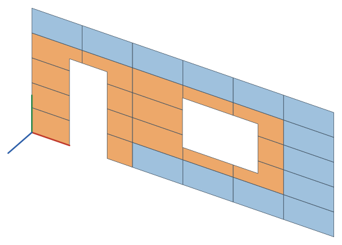

The shape's own corners are vertices exactly where it has them. A face a hair out of flat, as a modeller's can be, keeps
its corners where they are, the points the meshing puts on its sides stay on its sides, and only the points inside lie
on the plane. The faces run counter-clockwise seen from the side the normal points to.

### Which way the grid runs

A `MeshPlacement3` says which way the grid's first axis, or the strips, run in the shape's plane:

| `MeshPlacement3` | The first axis |
|---|---|
| `World`, unless another is given | level, the second axis running up the slope: along X and Y on a face level within the angle tolerance, along a wall and up it |
| `Own` | along the long side of the smallest rectangle round the shape, so that a rectangle's grid runs along its sides however it lies |
| `Upright` | as `World`, over a flat shape |
| `Along(direction)` | along a direction, laid onto the plane |
| `Frame(coordinateSystem)` | along the X axis of a coordinate system, laid onto the plane, or its Y axis where X stands square to the plane |

`MeshOptions.AngleRad` turns the first axis from there, counter-clockwise about the normal. On a roof the world's way
lays the tiles in level rows, up each side:

```csharp
GeoMesh3 tiles = roofSide.ToMesh(MeshOptions.Grid(400, 300));   // 150 tiles, every one whole
```

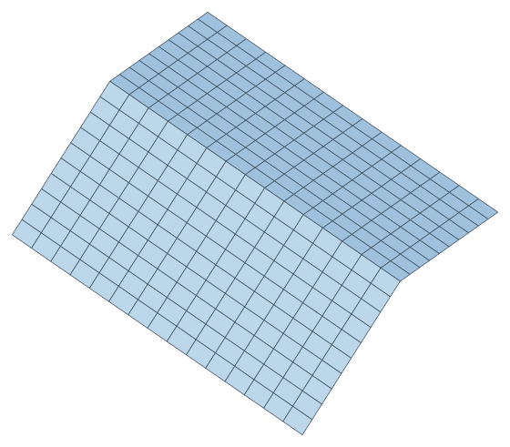

A plate lying askew, none of its sides level, lays a level grid across itself, and one of its own along its sides:

```csharp
GeoMesh3 level = plate.ToMesh(MeshOptions.Grid(600, 400));                     // 21 faces, 3 whole
GeoMesh3 own = plate.ToMesh(MeshOptions.Grid(600, 400), MeshPlacement3.Own);   // 12 faces, all whole
```

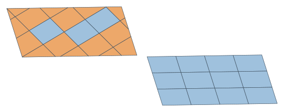

**An origin.** `At(origin)` puts a cell's first corner on a point of space, put onto the shape's plane along its normal,
and takes the place of the alignments. Walls laid from one origin have their rows at the same heights, and their columns
where the origin's lines cross them:

```csharp
MeshPlacement3 placement = MeshPlacement3.World.At(new GeoPoint3(-3000, -2000, 150));
GeoMesh3 front = frontWall.ToMesh(MeshOptions.Grid(1200, 600, joint: 10), placement);
GeoMesh3 side = sideWall.ToMesh(MeshOptions.Grid(1200, 600, joint: 10), placement);
```

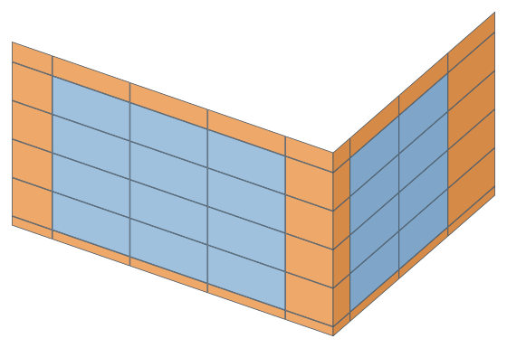

Along a line of space the cells stand where they would with its axis running the world's way, X before Y before Z,
whichever way a face's own frame runs along it: the two faces of a wall, whose frames run opposite ways along it, have
their joints on the same lines.

In space a grid's origin is a point of space. `MeshOptions.Origin`, a point of the plane, is refused here with an
`ArgumentException` that says to use `MeshPlacement3.At`.

### Other flat shapes

`GeoPolygon3`, `GeoFace3`, `GeoPolygonArc3`, `GeoCircle3` and `GeoTriangle3` all mesh the same way, with `ToMesh`. A
loop with arcs is flattened in space by the options' chord tolerance first, its corners kept where they are and the points
of each arc on the arc, and its mesh's normal is the one the loop runs counter-clockwise about; a disc's triangles are
fanned from its center, its normal the circle's, and a disc of no size has no faces; a triangle's normal runs from A by B
to C. A shape crossing itself is meshed as the region `MakeValid` reads, as in the plane: two arcs bulging in at a sharp
corner can cross before they part, and the lobe they close off, wound the other way, is material with the rest.

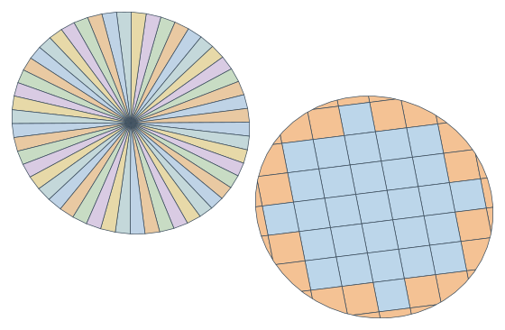

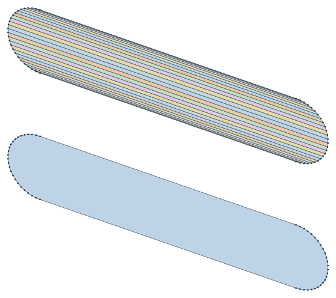

### The mesh

```csharp
GeoPolygon3 first = panels.GetFace(0);            // a polygon of space, counter-clockwise about the normal
int[] corners = panels.GetFaceIndices(0);         // its corners in panels.Vertices
GeoTriangle3[] triangles = panels.ToTriangles();  // for a renderer or an OBJ file
GeoMesh2 elevation = panels.ToMesh2();            // the same faces drawn in the frame, as an elevation
string obj = new ObjWriter().Add(panels, "panels").ToString();
```

`GeoMesh3` is a `GeoMesh2` standing in a plane: `IsWhole`, `GetEdges`, `GetBoundaryEdges`, `GetAdjacentFaces` and `Area`
are what they are in the plane, measured in space. `Frame` is the plane the faces were laid out in, its X axis the grid's
first axis, its Z axis `Normal`, and `ToMesh2` gives the faces in it with the same indexes. `Translate` and `TransformBy`
move the mesh; a mirror turns its normal round, as it turns a polygon's, and the faces still run counter-clockwise
about it, and a scaling, however small, lays them out again in the frame scaled. `GetFace` gives a face with every corner
it has: of a shape a hair out of flat, a triangle turns about the normal of its own corners, and a face of more corners
keeps them where the shape has them. The OBJ writer gives a face that turns right at no corner as one polygon, so that a
viewer shows the cells of a grid as they are, and any other as its triangles.

## Bodies in cells

Pour bays of 6000 by 4000 on a slab 12000 by 8000 and 250 thick, with a shaft 1500 by 1200 through it:

```csharp
GeoSolid3 pierced = slab.WithOpenings(new[] { shaft });
GeoCellGrid3 bays = pierced.ToCells(CellOptions3.Grid(6000, 4000, 0));

int count = bays.CellCount;               // 4
double volume = bays.Volume;              // 23 550 000 000, the slab's net volume
GeoCell3 first = bays.Cells[0];           // I 0, J 0, K 0
GeoSolid3 pour = first.Solid;             // a closed body
int[] beside = bays.GetAdjacentCells(0);  // 1 and 2
```

A size of nought leaves the body whole along that axis, so the slab is not cut through its thickness. The openings are cut
in first: each bay is cut to the shaft, and none is whole. Openings the whole body will not take are cut into each cell
they meet.

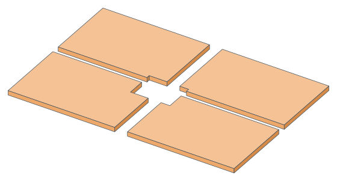

### Dividing the axes

Each of the grid's three axes is divided on its own, as its `CellAxis` says. The factories give the usual ones:

| `CellOptions3` | Cuts |
|---|---|
| `Grid(sizeX, sizeY, sizeZ, joint, alignment)` | cells of a size along each axis; a size of nought leaves the body whole that way |
| `Layers(thickness, joint, alignment)` | lifts up the grid's Z axis, the body whole across them |
| `Divide(countX, countY, countZ, joint)` | as many equal cells along each axis as asked, from the body's first side to its far one |
| `new CellOptions3(x, y, z, joint, snapDistance, maxDegreeOfParallelism)` | each axis its own `CellAxis.BySize(size, alignment)`, `CellAxis.ByCount(count)` or `CellAxis.Whole` |

A cell the body fills is whole. A cell the body's boundary crosses is cut to it; a box cut along its own sides is cut by
arithmetic, every cell a box, a million of them in about two thirds of a second.

```csharp
var box = new GeoAabb3(new GeoPoint3(0, 0, 0), new GeoPoint3(1000, 600, 400));
GeoCellGrid3 grid = box.ToCells(CellOptions3.Grid(300, 300, 300));    // 16 cells, 6 whole
```

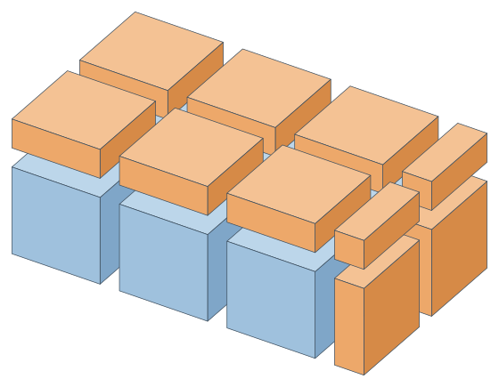

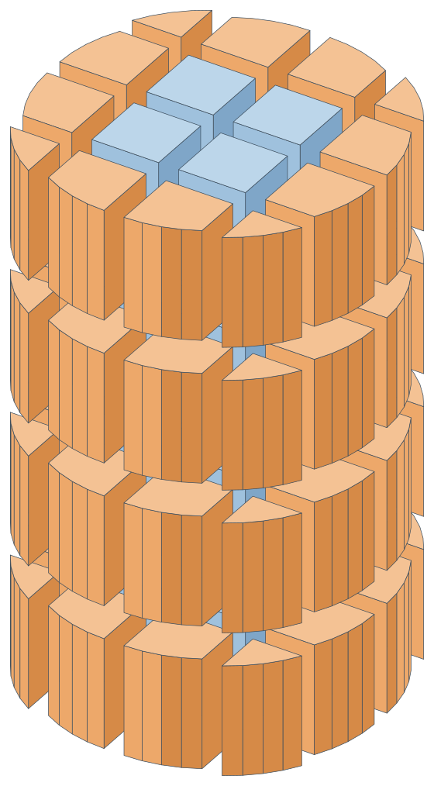

**Where the cells stand.** The `GridAlignment` of the plane says where the cut cells go along each axis divided by size,
measured between the body's furthest corners along it: `Start`, `End`, `CenterCell` or `CenterJoint`. A column poured in
lifts of 1000 from its foot:

```csharp
GeoCellGrid3 lifts = column.ToCells(CellOptions3.Layers(1000));   // 1000, 1000, 1000 and 500 high
```

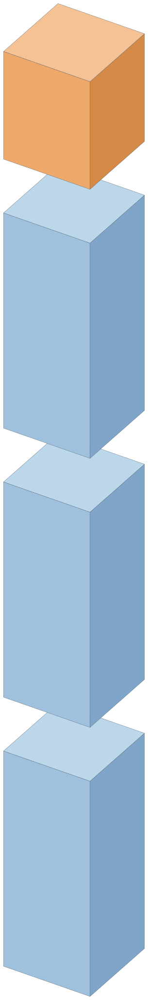

**Joints.** `joint` is the gap between two neighbouring cells along each axis divided, as the joints between blocks.
There is no gap at the body's boundary, where the cells are cut to it. Blocks of 390 by 190 with joints of 10:

```csharp
var wallOfBlocks = new GeoAabb3(new GeoPoint3(0, 0, 0), new GeoPoint3(4000, 190, 2400));
GeoCellGrid3 blocks = wallOfBlocks.ToCells(new CellOptions3(CellAxis.BySize(390), CellAxis.Whole, CellAxis.BySize(190), 10.0));
// 120 blocks, every one whole
```

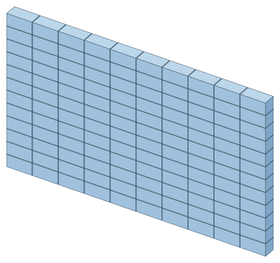

### Which way the grid runs

The same `MeshPlacement3` gives a body's grid all three axes:

| `MeshPlacement3` | The grid's axes |
|---|---|
| `World`, for a body and an axis-aligned box unless another is given | X, Y and Z |
| `Own`, for an oriented box unless another is given | the box's own axes; for a body, the smallest box round it, the axis nearest upright as Z and the longer of the other two as X |
| `Upright` | Z up the world's Z axis, X along the long side of the smallest rectangle round the body's plan |
| `Along(direction)` | X along the direction, Y level across it, Z as near up as is square to both |
| `Frame(coordinateSystem)` | the axes of a coordinate system |

`At(origin)` puts a cell's first corner on a point, in the place of the alignments; cells of bodies laid from one origin
line up across their faces. A wall turned 30 degrees in plan is cut along itself standing up, and across along the world's
axes:

```csharp
GeoCellGrid3 upright = wall.ToCells(CellOptions3.Grid(1000, 0, 1000), MeshPlacement3.Upright);   // 18 cells, all whole
GeoCellGrid3 world = wall.ToCells(CellOptions3.Grid(1000, 0, 1000));                             // 18 cells, none whole
```

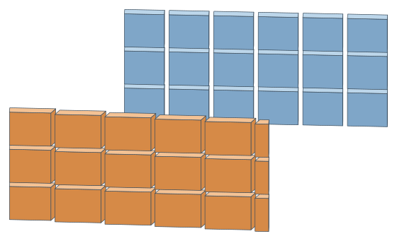

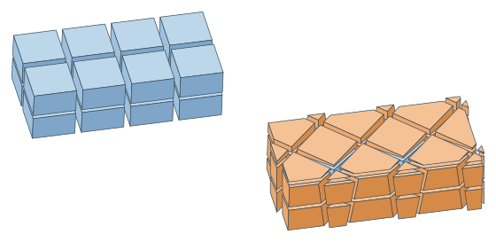

### Pieces, snapping and joints

**Pieces.** A cell the body holds in several pieces, as the cell across the notch of a U holds two, comes as one `GeoCell3`
a piece, with the same indexes, `Piece` telling them apart, numbered up Z, along Y and along X by their middles. Two pieces
of one cell never share a face; `GetAdjacentCells` gives the cells that do, found where their material meets across the
planes between them rather than by their indexes, and none where joints stand between.

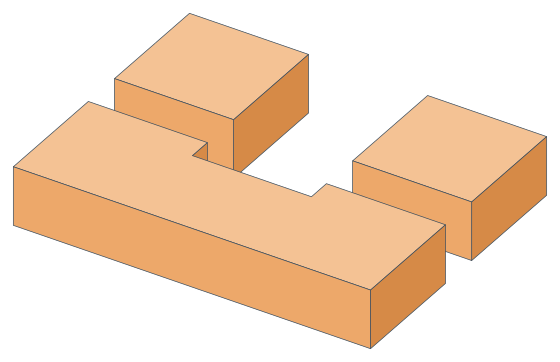

**Snapping.** Each cut is settled against the part of the body it cuts, in turn. One that would take off no more than the
snap distance from a side of the part, or four point tolerances however small the snap distance is, is not made: the slice
stays with the cell beside, so that no cell is cut thinner than the snap distance where the body leaves room. A part that
thin both ways, as a plate thinner than the snap distance lying across a line of cells, goes whole to the side holding
more of it, or below where the two hold as much. Any other cut that comes within the snap distance of a corner of the
part is moved onto the nearest, the higher of two as near, so that no cut runs a hair off a face of the body, and once
moved is not made where it would take off no more than four point tolerances. The snap distance is the point tolerance
unless the options give more. Features of the body closer together than the snap distance still leave the slice between
them.

```csharp
var options = new CellOptions3(CellAxis.BySize(500), CellAxis.BySize(500), CellAxis.Whole, snapDistance: 50);
GeoCellGrid3 cells = footing.ToCells(options);   // the step 30 past a line of cells goes with the cell beside
```

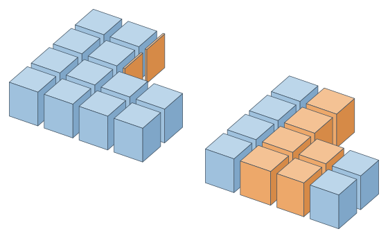

**Joints and snapping.** With a joint the cuts bound the joints, and are snapped, and slices left on, within the point
tolerance only, so that no cell is carried into a joint.

**A cut that cannot be made.** The point of a needle past a plane, a part thinner across than the point tolerance where
the plane meets it, stays with the cell that holds the rest of it. A cut the body will not take, which a closed body
should not give, leaves the part whole in the cell its middle stands in, or in the cell beside where the other side is a
joint or past the last cell, so that nothing is lost, and says so in `GeometryHelperLog`.

### The cells

```csharp
GeoCell3 cell = grid.GetCellsAt(3, 1, 1)[0];   // the pieces of the cell at an index
GeoObb3 whole = cell.Box;                      // the whole cell, where it stands in the grid
bool full = cell.IsWhole;                      // false: the box ends 100 into it
double held = cell.Volume;                     // 3 000 000
GeoObb3 empty = grid.GetBox(0, 0, 0);          // any cell the grid lays, whether or not the body holds any of it
string text = new ObjWriter().Add(grid, "cell").ToString();   // each cell an object of its own
```

`Frame` is the grid's frame: its axes are the grid's, and its origin the corner where the first cell along each axis
starts. `CountX`, `CountY` and `CountZ` count the cells the grid lays along each axis, `Cells` the ones the body holds any
of, in order up Z, along Y within a layer and along X within a row, the pieces of one cell in turn. A cell of a box is a
box, built as a body only when its `Solid` is asked for.

## What is promised

- Every cell is a closed body, wound outwards, of the volume it says. It holds what the body holds of its whole cell,
  `Box`, and lies within the box but for the snap distance, four point tolerances, and the point of a needle a cut could
  not take off, which stays with the cell beside: a part thinner across than the point tolerance where the cut meets it.
- The cells hold all of the body's material less the joints, without overlapping. Their volumes add up to the body's net
  volume but for the tolerance times the area cut: a face of the body within the tolerance of a cut is taken as lying in
  it, and the wedge between goes with it. Over hundreds of thousands of random bodies the median was two parts in ten
  million million, and the most two in a million.
- The openings are cut in first, into the whole body or, where it will not take them, into each cell they meet; a cell that
  will not take them either keeps their material, and says so in the log. A body the openings take wholly gives a grid
  with no cells.
- A cell is whole when the body fills it but for a skin no thicker than the point tolerance, every face of it on a side of
  its box; it keeps the shape it was cut to.
- A body that is not closed holds no volume to cut, and is refused with an `ArgumentException`, as is a cell no larger than
  the point tolerance along an axis it divides, or a grid of more than 1 000 000 cells through the body. A body wound
  inwards, as a mirror leaves one, is read the right way out, and its cells are wound outwards.
- The bodies are cut by planes, along X first, then each slab along Y and each bar along Z, on every processor unless
  `maxDegreeOfParallelism` says otherwise; the cells come out the same on one thread as on many.
