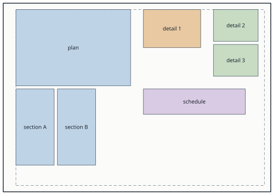
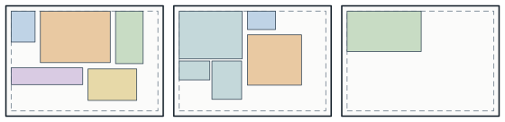
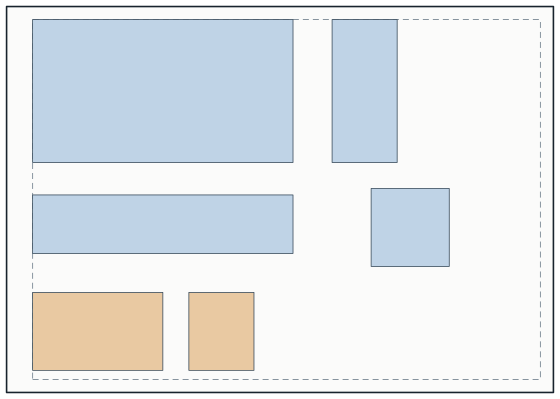
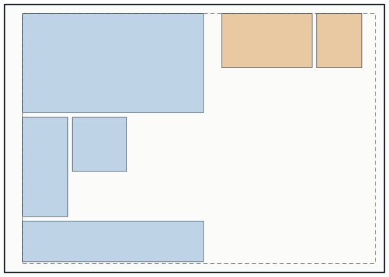
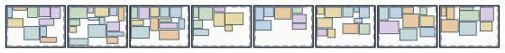
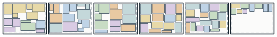

# Packing boxes onto sheets

`GeometryHelper.Packing` lays boxes out on sheets of paper: drawing views, schedules, anything that can be brought
to a `GeoRectangle2`. Every box goes inside the part of a sheet its offsets leave, each group of boxes that belong
together is kept together, and when a sheet is full the next one is begun beside it. The boxes are only moved,
never turned or resized: what comes back for each is how far it moves.

## Quick start

```csharp
using GeometryHelper.Geometry;
using GeometryHelper.Packing;

var sheet = new Sheet(PaperSize.A3)          // 420 x 297 mm, landscape
{
    OffsetLeft   = 20.0,
    OffsetRight  = 10.0,
    OffsetTop    = 10.0,
    OffsetBottom = 10.0,
};

var groups = new List<GeoRectangle2[]>
{
    new[] { plan, sectionA, sectionB },      // a view and its sections: kept together
    new[] { detail },
};

PackResult result = SheetPacker.Pack(groups, sheet, new PackOptions { Spacing = 5.0, GroupSpacing = 20.0 });

PackPlacement placement = result.Placements[0][1];   // sectionA: the same shape as the groups given
if (placement.Placed)
{
    int onSheet = placement.SheetIndex;              // which sheet it goes on, the first nought
    GeoVector2 move = placement.Translation;         // how far it moves
    GeoRectangle2 box = placement.ViewBox;           // the box, moved
}
```

With a plan 180 by 120, sections 60 by 120, details 90 by 60 and 70 by 50, and a schedule 160 by 40, it all goes on
the one A3, filling 50.7 % of the part inside the offsets:



## The sheet

A `Sheet` is the size of the paper, the scale it is drawn at, the offsets round its edges that nothing goes into,
and where it lies.

| Size | Millimetres | | Size | Millimetres |
|---|---|---|---|---|
| `A0` | 841 x 1189 | | `A3` | 297 x 420 |
| `A1` | 594 x 841 | | `A4` | 210 x 297 |
| `A2` | 420 x 594 | | `Sheet.Custom(width, height)` | any |

An A sheet lies across, landscape, unless it is turned: `new Sheet(PaperSize.A1, SheetOrientation.Portrait)`.

| Property | Default | Meaning |
|---|---|---|
| `Scale` | 1 | How many units of the boxes a millimetre of paper stands for: 50 for a drawing at 1:50 of boxes in millimetres of the model |
| `OffsetLeft`, `OffsetRight`, `OffsetTop`, `OffsetBottom` | 0 | How far in from each edge the boxes keep, in millimetres on paper |
| `Origin` | (0, 0) | Where the first sheet lies: its lower left corner, in the units of the boxes |
| `NewSheet` | `Right` | Which side of the one before each new sheet goes on: `Right`, `Left`, `Top` or `Bottom` |
| `SheetSpacing` | 0 | The gap between one sheet and the next, in millimetres on paper |

The paper size, the offsets and the spacings are on paper; times `Scale` they are in the units of the boxes, as the
origin, `Width`, `Height` and every frame are. An A1 sheet at 1:50 is 42,050 by 29,700:

```csharp
var sheet = new Sheet(PaperSize.A1) { Scale = 50.0 };
sheet.PlaceCorner(SheetCorner.UpperLeft, new GeoPoint2(0.0, 0.0));   // its upper left corner at the origin

SheetFrame second = sheet.GetFrame(1);   // the next sheet: to the right of the first
GeoPoint2 corner = second.Bounds.LowerLeft;                  // (42050, -29700)
GeoRectangle2 usable = second.UsableArea;                    // the part inside the offsets
```

`PlaceCorner` sets `Origin` from any corner, or the middle: a frame already drawn at a known point can be packed
where it is. Every frame is a `GeoRectangle2`, so each corner is there to read: `LowerLeft`, `UpperRight`, `Center`.

Nine groups of up to three boxes, on A4 sheets with offsets of 10 and a `SheetSpacing` of 20, take three sheets, each
begun to the right of the one before when it is full:



## Groups

Each `GeoRectangle2[]` is a group of boxes that belong together, packed onto a sheet as one block:

| `GroupLayout` | The boxes of a group |
|---|---|
| `Compact` (default) | laid out afresh, as close together as they go, in their order from the upper left: the first box, the main view, at the upper left of its block |
| `Keep` | as they stand to one another: a layout already drawn moves as one block, its boxes overlapping or not |

The boxes of a group stand `Spacing` apart, and the groups `GroupSpacing` apart, both in millimetres on paper: a
group spacing wider than the spacing shows which boxes belong together. A group too large for one sheet is split,
in its order, into blocks that each go onto one sheet, laid out compactly.

A layout of four views already drawn, in blue, and a group of two, in orange, on an A3. `Keep` moves the four as they
were drawn, gaps and all; `Compact` lays them out afresh, the first of them, the main view, at the upper left:

| | |
|---|---|
|  |  |
| `GroupLayout.Keep` | `GroupLayout.Compact` |

## Where the boxes go

`result.Placements[g][i]` is the box `groups[g][i]`:

| Property | Meaning |
|---|---|
| `SheetIndex` | Which sheet the box goes on, the first nought; -1 for one that goes on none |
| `Translation` | How far the box moves, the sheets lying where `Origin` and `NewSheet` lay them |
| `ViewBox` | The box moved by `Translation`, the same size and turn |
| `Placed` | Whether it found a place; false only for a box larger than the usable area of a sheet, or not at finite coordinates |

`result.Sheets` are the frames of the sheets taken, the first always among them, and `result.Utilization` how much
of their usable area the placed boxes fill.

The move is the same for every point of what a box stands for, so adding `Translation` to any point of it, the origin
of a drawing view or the insertion point of a block, puts it where its box goes. The box only has to be given in the
same coordinates as that point:

```csharp
foreach (View view in views)   // the views of one drawing, their boxes in the same order
{
    PackPlacement placement = result.Placements[0][index++];
    view.Origin = view.Origin + placement.Translation;
}
```

## Order and filling

The blocks are placed by the maximal rectangles method, each where its top is highest, then its left side furthest
left, so that a sheet fills from its upper left corner as the eye reads it. Two options trade that order for fewer
sheets:

| `PackOptions` | Default | When set |
|---|---|---|
| `LargestGroupsFirst` | false, the groups in their order | the largest blocks first: they pack tighter |
| `FillEarlierSheets` | false, each sheet filled before the next, no group going back | a group goes onto the first sheet with room for it |

A thousand boxes of up to a fifth of an A1 sheet, one to a group, take 17 sheets in their order and 14 with both
set, as few as their area allows. With both set the sheets no longer read in the order the groups were given;
the boxes of a group are kept together either way.

Sixty groups, 79 boxes of 30 to 140 by 20 to 100, on A3 sheets: in their order they take eight sheets, filled 49.4 %,
and with both options set six, filled 65.8 %:





## What is promised

- A box reported `Placed` lies inside the usable area of its sheet, and clear of every other box, but the boxes of
  its own group kept as they stood. The packing is judged as it came out, box by box.
- Every box that fits the usable area of a sheet is placed: when one sheet is full, the next is begun.
- A box is only moved: `ViewBox` is the box given, moved by `Translation`.
- The same boxes and options give the same result; the boxes, the sheet and the options are only read.
